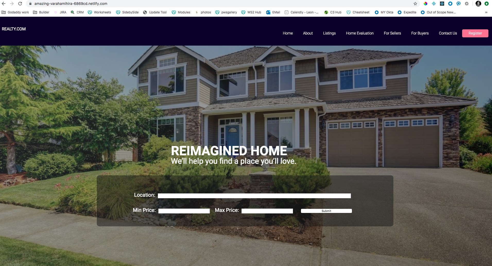
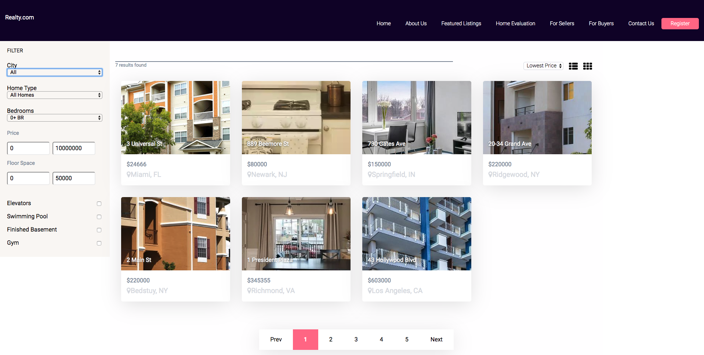

#  Real Estate Project

This project was built with the library React Js, as I wanted to get more comfortable with the library and using front end frameworks.

* Filters - All filters on the front end use dummy data for the listings.

* Pages - Additional pages were created to use react router.

**Demo**
---------

The project is live on Netlify -
[Click Here](https://amazing-varahamihira-6869cd.netlify.com)

 **Built With**

* HTML5
* CSS3 / SASS
* React JS
* Webpack
* Babel
* Node Js

**Screenshots**

